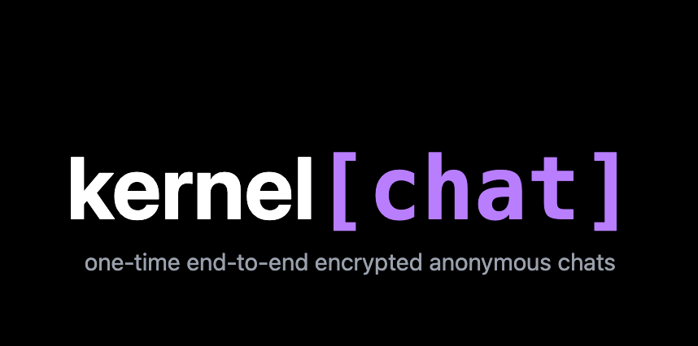
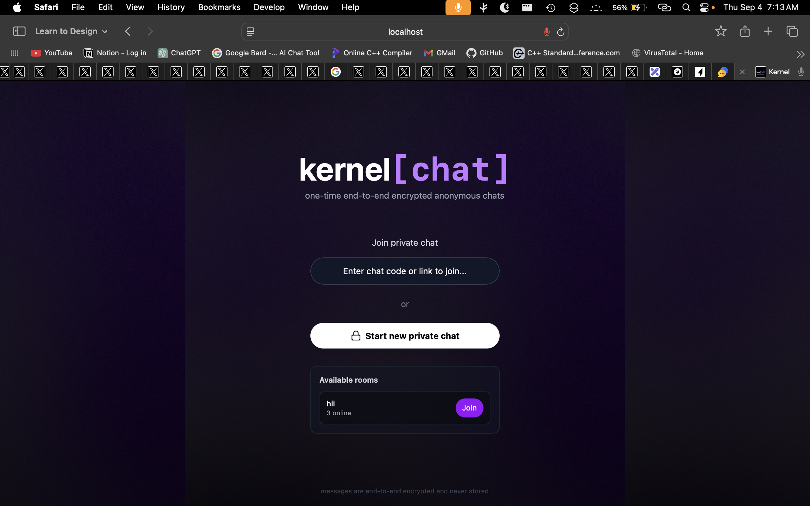
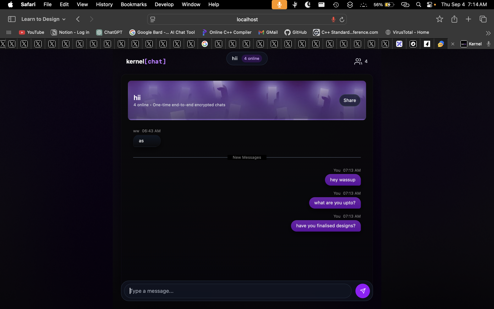
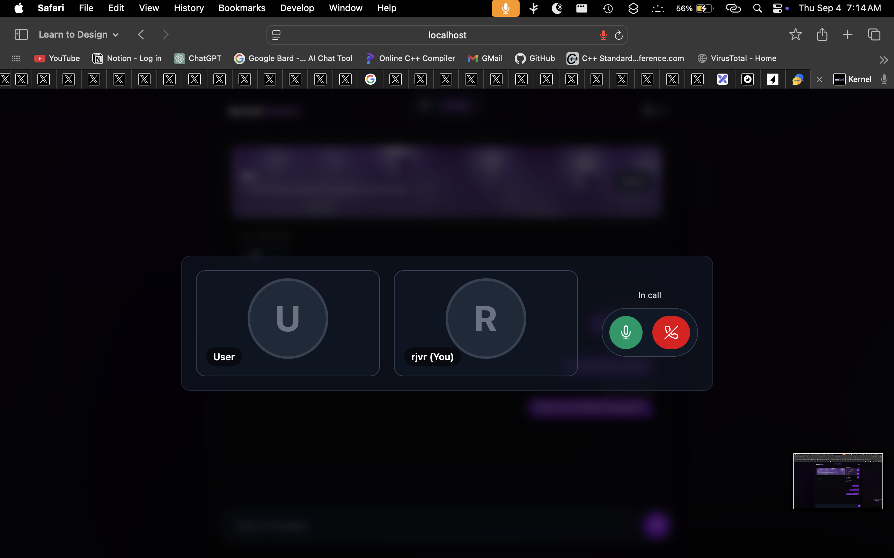
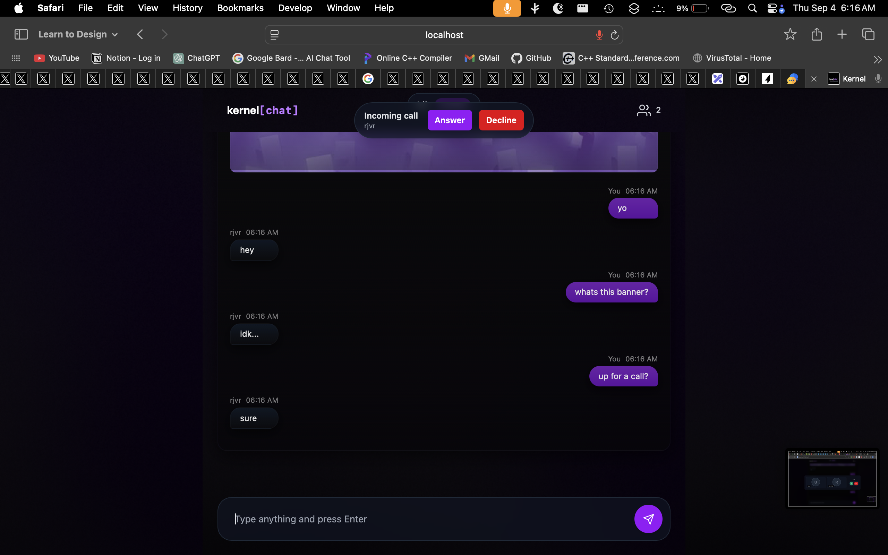
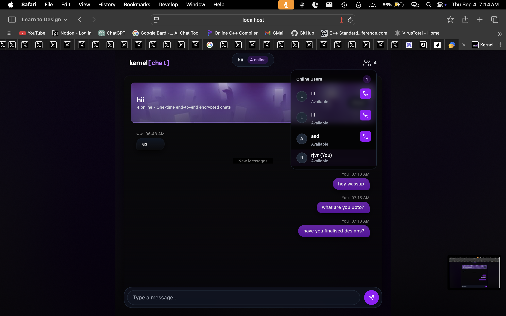

<p align="center">
  
</p>

<h1 align="center">Kernel Chat</h1>
<p align="center">
  <strong>High-signal, no-noise communication.</strong>
</p>

<br>

Kernel is a real-time, anonymous chat application designed for fast and private conversations. It provides room-based communication channels for both text and peer-to-peer audio calls without requiring permanent user accounts.

The core principle of Kernel is to facilitate immediate and secure interaction. Users can instantly create a private chat room, share the unique link, and begin conversing with others who join. All chat history is persistent for the life of the room, and audio calls are handled directly between peers for maximum privacy and performance.


---

## Table of Contents

-   [Key Features](#key-features)
-   [Tech Stack](#tech-stack)
-   [Project Architecture](#project-architecture)
-   [Project Structure](#project-structure)
-   [Setup and Installation](#setup-and-installation)

---

## Key Features

-   **Anonymous & Ephemeral Rooms:** Instantly create chat rooms with unique, shareable links without needing to sign up.
-   **Persistent Text Chat:** Chat history is saved and loaded for all users in a room, allowing for seamless re-entry into conversations.
-   **Peer-to-Peer Audio Calls:** High-quality, low-latency audio calls are established directly between users via WebRTC, ensuring the server never processes the audio stream.
-   **Real-Time Presence:** See a live count and list of all online users in a room.
-   **Responsive Design:** A clean, minimal, and fully responsive user interface that works across all screen sizes.

<p align="center">
  
</p>
<p align="center"><em>Landing / homepage view.</em></p>

<p align="center">
  
</p>
<p align="center"><em>Chat room: messages, participants, and controls.</em></p>

<p align="center">
  
</p>
<p align="center"><em>Active call UI / controls.</em></p>

<p align="center">
  
</p>
<p align="center"><em>Incoming call notification modal.</em></p>

<p align="center">
  
</p>
<p align="center"><em>Online users list / presence indicator.</em></p>


---

## Tech Stack

This project is a full-stack MERN application with a focus on real-time technologies.

| Category      | Technology                | Purpose                                            |
| ------------- | ------------------------- | -------------------------------------------------- |
| **Frontend**  | React, Vite, Tailwind CSS | For a fast, modern, and responsive user interface. |
| **Backend**   | Node.js, Express          | For the core server logic and API endpoints.       |
| **Database**  | MongoDB (with Mongoose)   | To provide persistence for room-based chat history.|
| **Real-Time** | **Socket.IO**             | For text messaging, user presence, and WebRTC signaling. |
| **Real-Time** | **WebRTC**                | For direct peer-to-peer audio streaming.           |

---

## Project Architecture

The application is built on a client-server model but utilizes a peer-to-peer architecture for its most bandwidth-intensive feature.

1.  **Client-Server (for Chat & Signaling):** The Node.js server acts as the central hub for all text-based communication. It manages user presence within rooms, handles the storage and retrieval of chat messages from MongoDB, and, most critically, serves as the **Signaling Server** for WebRTC.

2.  **Peer-to-Peer (for Audio):** For audio calls, the server's only role is to perform the initial "handshake" between users. Once the connection is established, the audio data is streamed directly between the clients' browsers, ensuring low latency and privacy.


---

## Project Structure

The repository is a monorepo structured into two main directories: `client` and `server`.

```
kernel-chat/
├── client/         # Contains the React Frontend (Vite)
│   ├── public/
│   └── src/
│       ├── components/ # Reusable React components (CallUI, Modals, etc.)
│       └── pages/      # Main page components (HomePage, ChatRoom)
└── server/         # Contains the Node.js Backend
    ├── models/     # Mongoose schemas (Message, User)
    ├── routes/     # Express API routes
    └── src/        # Main server logic (index.js)
```

---

## Setup and Installation

To run this project locally, you will need Node.js and MongoDB installed on your system.

1.  **Clone the repository:**
    ```bash
    git clone https://github.com/rajveeerr/Kernel.git
    cd Kernel
    ```

2.  **Setup the Backend Server:**
    ```bash
    cd server
    npm install
    ```
    Create a `.env` file in the `server` directory and add your environment variables:
    ```
    PORT=3000
    MONGO_URL=mongodb://your_mongodb_connection_string
    ```
    Start the server:
    ```bash
    npm run dev
    ```    The server will be running on `http://localhost:3000`.

3.  **Setup the Frontend Client:**
    Open a new terminal window.
    ```bash
    cd client
    npm install
    ```    Create a `.env` file in the `client` directory and point it to your backend:
    ```
    VITE_BACKEND_URL=http://localhost:3000
    ```
    Start the client:
    ```bash
    npm run dev
    ```
    The application will be available at `http://localhost:5173` (or another port specified by Vite).

---
